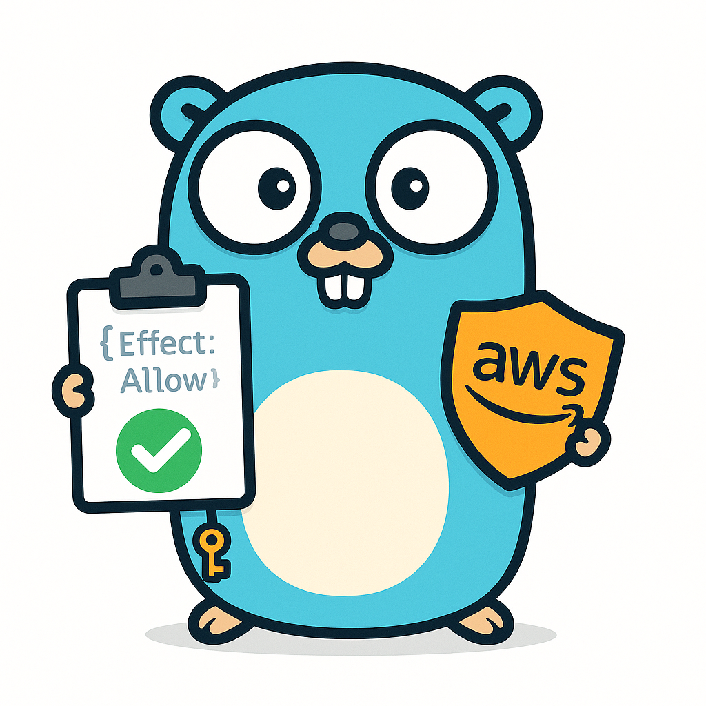

<p align="center">
  
</p>

# politest

## Build & Quality

[](https://github.com/reaandrew/politest/actions/workflows/ci.yml)
[](https://sonarcloud.io/summary/new_code?id=reaandrew_politest)
[](https://sonarcloud.io/summary/new_code?id=reaandrew_politest)
[](https://sonarcloud.io/summary/new_code?id=reaandrew_politest)
[](https://sonarcloud.io/summary/new_code?id=reaandrew_politest)
[](https://goreportcard.com/report/github.com/reaandrew/politest)
[](https://github.com/reaandrew/politest/network/updates)

## Security

[](https://scorecard.dev/viewer/?uri=github.com/reaandrew/politest)
[](https://sonarcloud.io/summary/new_code?id=reaandrew_politest)
[](https://sonarcloud.io/summary/new_code?id=reaandrew_politest)
[](https://github.com/reaandrew/politest/actions/workflows/codeql.yml)
[](https://semgrep.dev/)
[](https://www.gitguardian.com/)

## Supply Chain Security

[](https://slsa.dev/)
[](https://github.com/reaandrew/politest/actions/workflows/dependency-review.yml)
[](https://www.stepsecurity.io/)

All release binaries are built with [SLSA Level 3](https://slsa.dev/) provenance attestations, providing:

- **Verifiable Builds** - Cryptographic proof that binaries were built from this repository's source code
- **Tamper Protection** - Detect if binaries were modified after build
- **Build Transparency** - Complete audit trail showing exact source, build time, and build process
- **Supply Chain Defense** - Protection against compromised build servers and malicious insider modifications

Users can verify binary authenticity using [slsa-verifier](https://github.com/slsa-framework/slsa-verifier):

```bash
slsa-verifier verify-artifact politest-linux-amd64 \
  --provenance-path politest-linux-amd64.intoto.jsonl \
  --source-uri github.com/reaandrew/politest
```

## Project Info

[](https://go.dev/)
[](https://github.com/reaandrew/politest/releases)
[](LICENSE)
[](CONTRIBUTING.md)

A single-binary Go tool for testing AWS IAM policies using scenario-based YAML configurations.

## Features

- **YAML-based scenarios**
  - Inheritance via `extends:`

- **Multiple variable formats**
  - `{{.VAR}}`, `${VAR}`, `$VAR`, `<VAR>` syntax support

- **Policy templates**
  - Use `policy_template` for policies with variables
  - Or `policy_json` for pre-rendered JSON policies

- **Test collection format**
  - `tests` array with named test cases

- **SCP/RCP merging**
  - From multiple files/globs into permissions boundaries

- **AWS IAM SimulateCustomPolicy integration**
  - Test policies before deployment

- **Expectation assertions**
  - For CI/CD integration

- **Clean table output**
  - With optional raw JSON export

## ⚠️ Understanding What politest Tests

**politest is a pre-deployment validation tool that helps you catch IAM policy issues early, but it is NOT a replacement for integration testing in real AWS environments.**

### What politest Does

politest uses AWS's `SimulateCustomPolicy` API to evaluate policies **before deployment**. This provides:

✅ **Fast feedback loop**
  - Test policy changes in seconds without deploying

✅ **Blended testing**
  - See how identity policies interact with SCPs/RCPs

✅ **Fail fast**
  - Catch obvious misconfigurations early in development

✅ **CI/CD integration**
  - Automated policy validation on every commit

### Important Limitations

⚠️ **politest "bends the rules" for testing convenience:**

- **SCPs/RCPs in SimulateCustomPolicy**
  - The API wasn't designed for testing organizational policies alongside identity policies
  - politest uses the `PermissionsBoundaryPolicyInputList` parameter to simulate SCP/RCP behavior
  - This **approximates** real-world behavior but may not be 100% accurate

- **Simulation vs Reality**
  - `SimulateCustomPolicy` provides a **best-effort simulation**
  - Some complex conditions, resource policy interactions, and edge cases may behave differently in production

- **Missing Context**
  - Real AWS environments have additional factors not fully captured in simulation
  - Resource ownership, trust policies, session policies, permission boundaries

### What You Still Need

✅ **Integration testing in actual AWS accounts**
  - Deploy policies to dev/staging and test real resource access

✅ **Production validation**
  - Verify permissions work as expected with real workloads

✅ **Security reviews**
  - Have security teams review policies before production deployment

**Remember:** politest helps you **fail faster during development** by catching obvious mistakes before deployment. Use it as **unit tests for IAM policies** - essential for development velocity, but always validate with real integration tests in actual AWS environments.

## Installation

```bash
# Build the binary
go build -o politest

# Or run directly
go run . --scenario path/to/scenario.yml
```

## Quick Start

### 1. Create a base scenario (`scenarios/_common.yml`)

```yaml
vars:
  account_id: "123456789012"
  region: "us-east-1"

scp_paths:
  - "../scp/010-base.json"
  - "../scp/020-guardrails.json"

context:
  - ContextKeyName: "aws:RequestedRegion"
    ContextKeyValues: ["{{ .region }}"]
    ContextKeyType: "string"
```

### 2. Create a specific test scenario (`scenarios/athena_test.yml`)

```yaml
extends: "_common.yml"

vars:
  workgroup: "primary"

policy_template: "../policies/athena_policy.json.tmpl"

tests:
  - name: "BatchGetNamedQuery should be allowed"
    action: "athena:BatchGetNamedQuery"
    resource: "arn:aws:athena:{{ .region }}:{{ .account_id }}:workgroup/{{ .workgroup }}"
    context:
      - ContextKeyName: "aws:CalledVia"
        ContextKeyValues: ["athena.amazonaws.com"]
        ContextKeyType: "stringList"
    expect: "allowed"

  - name: "GetQueryExecution should be allowed"
    action: "athena:GetQueryExecution"
    resource: "arn:aws:athena:{{ .region }}:{{ .account_id }}:workgroup/{{ .workgroup }}"
    context:
      - ContextKeyName: "aws:CalledVia"
        ContextKeyValues: ["athena.amazonaws.com"]
        ContextKeyType: "stringList"
    expect: "allowed"
```

### 3. Create a policy template (`policies/athena_policy.json.tmpl`)

```json
{
  "Version": "2012-10-17",
  "Statement": [
    {
      "Sid": "AthenaAccess",
      "Effect": "Allow",
      "Action": [
        "athena:BatchGetNamedQuery",
        "athena:GetQueryExecution"
      ],
      "Resource": "arn:aws:athena:{{ .region }}:{{ .account_id }}:workgroup/{{ .workgroup }}",
      "Condition": {
        "StringEquals": {
          "aws:RequestedRegion": "{{ .region }}"
        }
      }
    }
  ]
}
```

### 4. Create SCP files (optional, `scp/010-base.json`)

```json
{
  "Version": "2012-10-17",
  "Statement": [
    {
      "Effect": "Allow",
      "Action": "*",
      "Resource": "*"
    }
  ]
}
```

### 5. Run the test

```bash
# Run with expectations (fails on mismatch)
./politest --scenario scenarios/athena_test.yml

# Run without assertions
./politest --scenario scenarios/athena_test.yml --no-assert

# Save raw AWS response
./politest --scenario scenarios/athena_test.yml --save /tmp/response.json
```

## Usage

```bash
politest [flags]

Flags:
  --scenario string    Path to scenario YAML (required)
  --save string        Path to save raw JSON response (optional)
  --no-assert          Do not fail on expectation mismatches (optional)
  --no-warn            Suppress SCP/RCP simulation approximation warning (optional)
```

## Scenario Configuration

### Required Fields

**Policy** - One of:

- `policy_template: "path/to/policy.json.tpl"`
  - Path to a policy file with template variables
  - Supports `{{.VAR}}`, `${VAR}`, `$VAR`, and `<VAR>` variable formats
  - Variables are substituted before policy is used
- `policy_json: "path/to/policy.json"`
  - Path to a plain JSON policy file
  - Use when policy has no variables or is already rendered

**Tests** - Required:

- `tests: [{action, resource, expect}]`
  - Array of test cases with individual settings
  - Each test can have its own action, resources, context, and expectations
  - Supports both `action` (single) and `actions` (array expansion)
  - Supports both `resource` (single) and `resources` (array)
  - See examples below for detailed syntax

### Optional Fields

- `extends: "parent.yml"`
  - Path to parent scenario (supports inheritance)
- `vars_file: "vars.yml"`
  - Path to YAML file with variables
- `vars: {key: value}`
  - Inline variables (overrides vars_file)
- `scp_paths: ["scp/*.json"]`
  - List of SCP file paths or globs to merge
- `context: [{ContextKeyName, ContextKeyValues, ContextKeyType}]`
  - List of context entries for conditions

### Action and Resource Fields

**Single vs Array in Tests:**

- `action: "s3:GetObject"`
  - Single action to test
- `actions: ["s3:GetObject", "s3:PutObject", "s3:ListBucket"]`
  - Multiple actions - expands into separate tests (one test per action)
  - All other test properties (resource, context, expect) are copied to each expanded test
- `resource: "arn:aws:s3:::bucket/*"`
  - Single resource ARN
- `resources: ["arn:aws:s3:::bucket1/*", "arn:aws:s3:::bucket2/*"]`
  - Multiple resource ARNs tested together

**Note:** You can use either `action` or `actions` (not both), and either `resource` or `resources` in each test case.

### Inheritance with `extends:`

Child scenarios inherit all fields from parent and can override:

- **Variables**
  - Deep-merged (child overrides parent)
- **Other fields**
  - Completely replaced (not merged)
- **Relative paths**
  - Resolved from the scenario file's directory

### Variables

Variables can be defined in three places (priority order):

1. **Inline `vars:` in the scenario**
2. **External `vars_file:` YAML**
3. **Inherited from parent via `extends:`**

**Variable Formats:**

politest supports multiple variable syntax formats for flexibility:

- `{{.variable_name}}`
  - Go template syntax (original format)
- `${VARIABLE_NAME}`
  - Shell/environment variable style with braces
- `$VARIABLE_NAME`
  - Environment variable style without braces
- `<VARIABLE_NAME>`
  - Custom angle bracket style

All formats are converted to Go templates internally, so you can mix and match in the same file:

```yaml
vars:
  account_id: "123456789012"
  ACCOUNT_ID: "123456789012"  # Can use different case for different formats

policy_template: "policy.json"  # Contains ${ACCOUNT_ID} and <ACCOUNT_ID>
resources:
  - "arn:aws:iam::{{.account_id}}:role/MyRole"  # Go template syntax
```

### Context Entries

```yaml
context:
  - ContextKeyName: "aws:RequestedRegion"
    ContextKeyValues: ["us-east-1", "eu-west-1"]
    ContextKeyType: "stringList"  # string, stringList, numeric, numericList, boolean, booleanList
```

**Supported Context Types:**

- `string`
  - Single string value

- `stringList`
  - List of strings

- `numeric`
  - Single numeric value

- `numericList`
  - List of numeric values

- `boolean`
  - Single boolean value

- `booleanList`
  - List of boolean values

**Note:** IpAddress and IpAddressList types are not supported by the AWS SDK.

### SCP Merging

Multiple SCP files are merged into a single permissions boundary:

```yaml
scp_paths:
  - "../scp/010-base.json"
  - "../scp/*.json"  # globs supported
  - "../scp/specific-restriction.json"
```

All statements from all files are combined into one policy document.

## Output

### Table Output

```
Action                         Decision  Matched (details)
----------------------------  --------  ----------------------------------------
athena:BatchGetNamedQuery     allowed   PolicyInputList.1
athena:GetQueryExecution      allowed   PolicyInputList.1
```

### Exit Codes

- `0`
  - Success (all expectations met or no expectations)
- `1`
  - Error (invalid scenario, AWS error, etc.)
- `2`
  - Expectation failures (unless `--no-assert` used)

## Examples

### Example 1: Simple Policy Test

```yaml
# scenarios/s3_read.yml
policy_json: "../policies/s3_read.json"

tests:
  - name: "GetObject should be allowed"
    action: "s3:GetObject"
    resource: "arn:aws:s3:::my-bucket/*"
    expect: "allowed"

  - name: "ListBucket should be denied"
    action: "s3:ListBucket"
    resource: "arn:aws:s3:::my-bucket/*"
    expect: "implicitDeny"
```

### Example 2: Template with Variables

```yaml
# scenarios/dynamodb_test.yml
vars:
  table_name: "users-table"
  region: "us-west-2"
  account_id: "123456789012"

policy_template: "../policies/dynamodb.json.tmpl"

tests:
  - name: "DynamoDB access"
    actions:  # Using actions array - expands to multiple tests
      - "dynamodb:GetItem"
      - "dynamodb:PutItem"
    resource: "arn:aws:dynamodb:{{ .region }}:{{ .account_id }}:table/{{ .table_name }}"
    expect: "allowed"
```

### Example 3: With SCPs and Context

```yaml
# scenarios/ec2_restricted.yml
extends: "_common.yml"

policy_template: "../policies/ec2.json.tmpl"

scp_paths:
  - "../scp/region-restriction.json"
  - "../scp/instance-type-restriction.json"

tests:
  - name: "RunInstances should be denied by SCP"
    action: "ec2:RunInstances"
    resource: "*"
    context:
      - ContextKeyName: "aws:RequestedRegion"
        ContextKeyValues: ["us-east-1"]
        ContextKeyType: "string"
      - ContextKeyName: "ec2:InstanceType"
        ContextKeyValues: ["t3.micro"]
        ContextKeyType: "string"
    expect: "explicitDeny"
```

## AWS Credentials

The tool uses the AWS SDK v2 default credential chain:

- **Environment variables**
  - `AWS_ACCESS_KEY_ID`, `AWS_SECRET_ACCESS_KEY`
- **Shared credentials file**
  - `~/.aws/credentials`
- **IAM role**
  - When running on EC2/ECS/Lambda

Required IAM permission: `iam:SimulateCustomPolicy`

## Development

### Running Tests

```bash
# Run unit tests (if any exist)
go test -race -coverprofile=coverage.out -covermode=atomic ./...

# Run integration tests (requires AWS credentials)
cd test && bash run-tests.sh
```

Integration tests are located in the `test/` directory and cover:
- Policy-only allow scenarios
- Policy allows, SCP denies
- Policy allows, RCP denies
- Multiple SCPs merging
- Explicit deny in policy
- Template variables
- Context conditions

### Pre-commit Hooks

This project uses [lefthook](https://github.com/evilmartians/lefthook) for Git hooks:

```bash
# Install hooks
lefthook install

# Hooks run automatically on commit:
# - gofmt -w (auto-format)
# - go vet (static analysis)
# - staticcheck (linting)
# - go test (unit tests)
# - go mod tidy (dependency cleanup)
# - trailing whitespace check
```

### CI/CD

The GitHub Actions workflow (`.github/workflows/ci.yml`) runs:
- Linting and testing
- Dependency scanning (Trivy)
- Secret detection (GitGuardian)
- Code quality analysis (SonarCloud)
- Security scanning (Semgrep)
- Cross-platform builds
- Integration tests against real AWS API
- Semantic versioning releases
- SLSA Level 3 provenance generation for all release binaries

## Tips

1. **Organize scenarios**
   - Use `_common.yml` for shared config, extend in specific tests

2. **Use templates**
   - Policy templates with variables make tests reusable across accounts/regions

3. **CI Integration**
   - Use `expect:` assertions and check exit codes

4. **Debug**
   - Use `--save` to inspect raw AWS responses and examine `MatchedStatements`

5. **Glob SCPs**
   - Use wildcards to merge multiple SCP files automatically

6. **Case-insensitive decisions**
   - Expected decisions are compared case-insensitively (e.g., "allowed" matches "Allowed")

## Project Structure Example

```
.
├── politest              # binary
├── scenarios/
│   ├── _common.yml       # base configuration
│   ├── athena_test.yml
│   ├── s3_test.yml
│   └── ec2_test.yml
├── policies/
│   ├── athena_policy.json.tmpl
│   ├── s3_policy.json
│   └── ec2_policy.json.tmpl
└── scp/
    ├── 010-base.json
    ├── 020-region-restriction.json
    └── 030-service-restriction.json
```

## License

MIT
